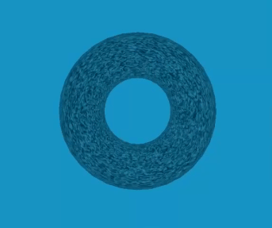

# A-Frame Draw Shader

A shader to draw canvas [A-Frame](https://aframe.io) VR. Inspired by [@maxkrieger](https://github.com/maxkrieger)'s [`draw`](https://github.com/maxkrieger/aframe-draw-shader-component) component.

## Note

This is only tested with A-Frame version [1.3.0](https://aframe.io/docs/1.3.0/introduction/).

**[DEMO](https://mayognaise.github.io/aframe/aframe-draw-shader.html)**



## Properties

| Property | Description   | Default Value           |
| -------- | ------------- | ----------------------- |
| width    | canvas width  | 256                     |
| height   | canvas height | 256                     |
| fps      | fps to render | null (render each tick) |

For refference, please check the following links:

- [Material](https://aframe.io/docs/1.3.0/components/material.html)

## Events

- **`draw-render`** is called every framerate (fps).

`event.detail` includes `canvas`, context `ctx` and `texture`.

```js
this.el.addEventListener("draw-render", function (event) {
  // draw!
  const ctx = event.detail.ctx;

  // drawing...
  ctx.rect(20, 20, 150, 100);
  ctx.stroke();
});
```

## Usage

### Browser Installation

Install and use by directly including the [browser files](https://cdn.jsdelivr.net/gh/mayognaise/aframe/packages/aframe-draw-shader/aframe-draw-shader.js):

```html
<head>
  <title>My A-Frame Scene</title>
  <script src="https://aframe.io/releases/1.3.0/aframe.min.js"></script>
  <script src="https://cdn.jsdelivr.net/gh/mayognaise/aframe/packages/aframe-draw-shader/aframe-draw-shader.js"></script>
  <script>
    /**
     * Noise component example
     */
    AFRAME.registerComponent("noise", {
      init(event) {
        this.el.addEventListener("draw-render", this.render);
      },
      remove() {
        this.el.removeEventListener("draw-render", this.render);
      },
      render({
        detail: {
          canvas: { width, height },
          ctx,
          texture,
        },
      }) {
        const idata = ctx.createImageData(width, height);
        const buffer32 = new Uint32Array(idata.data.buffer);
        buffer32.forEach((_, index) => {
          buffer32[index] = ((255 * Math.random()) | 0) << 24;
        });
        ctx.putImageData(idata, 0, 0);
      },
    });
  </script>
</head>

<body>
  <a-scene>
    <a-torus
      id="torus"
      position="0 1.5 -5"
      animation="property: rotation; to: 360 360 360; dur: 20000; easing: linear; loop: true"
      material="shader:draw;fps:5;opacity:.8;"
      noise
    >
    </a-torus>
    <a-sky color="dodgerblue"></a-sky>
  </a-scene>
</body>
```

### NPM Installation

Install via NPM:

```bash
npm i aframe-draw-shader
```

Then register and use.

```js
import "aframe";
import "aframe-draw-shader";
```
